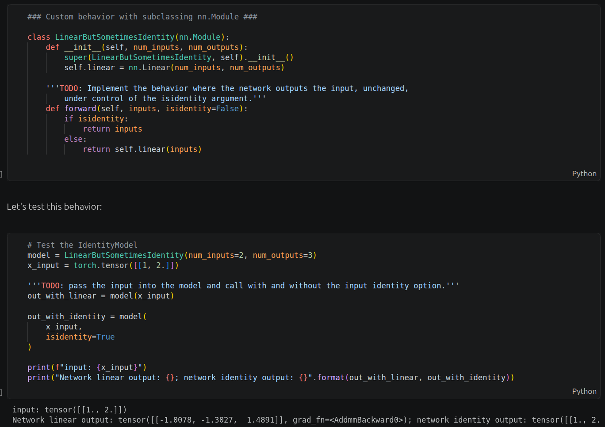
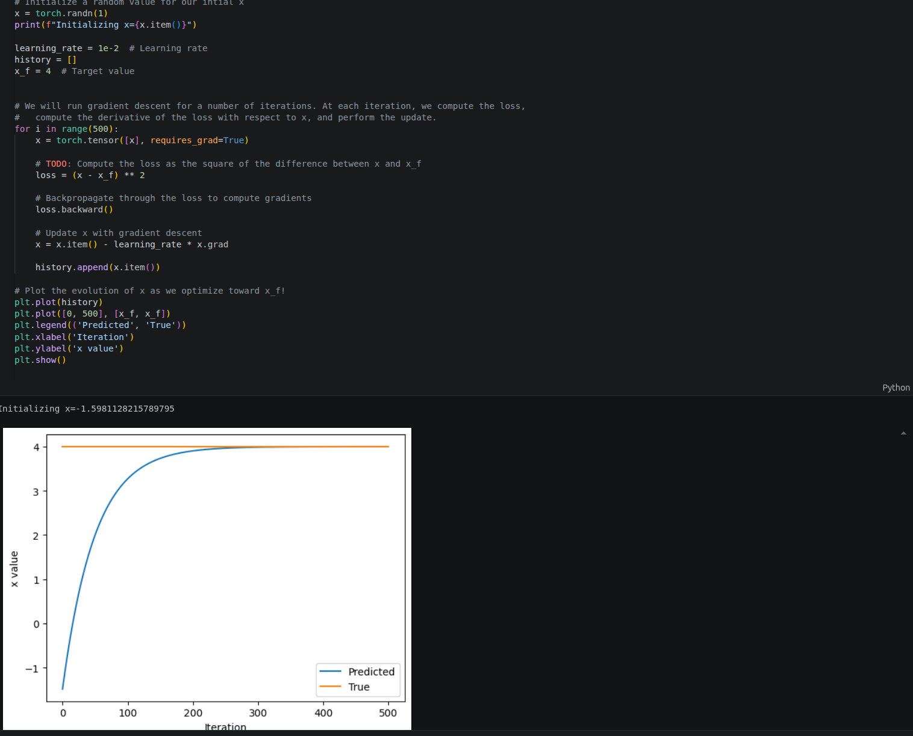
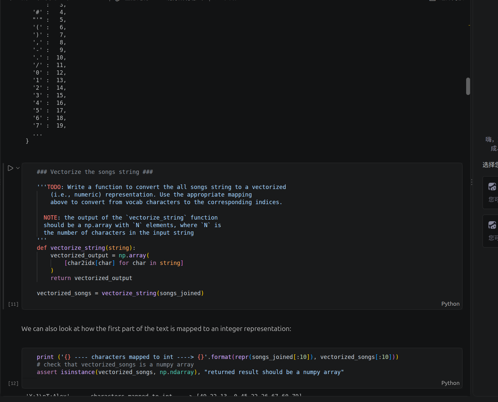
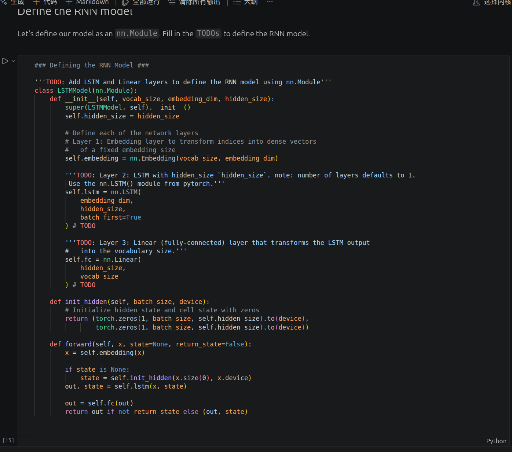
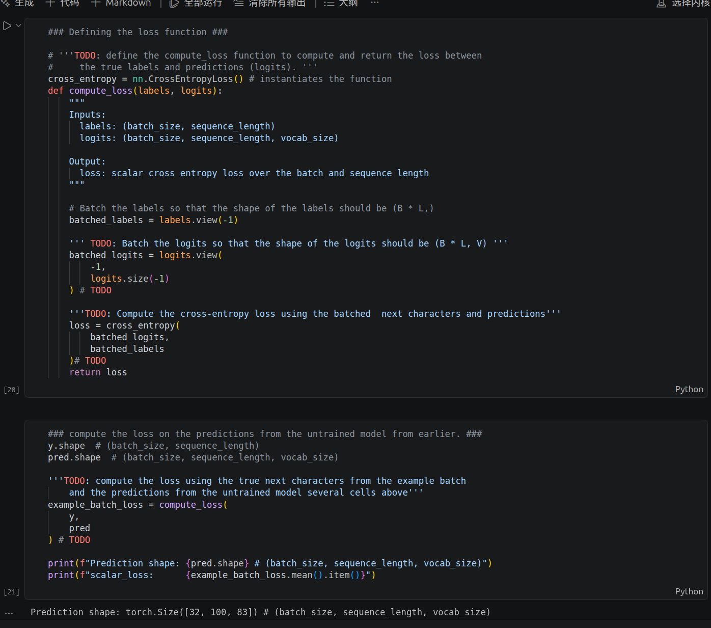
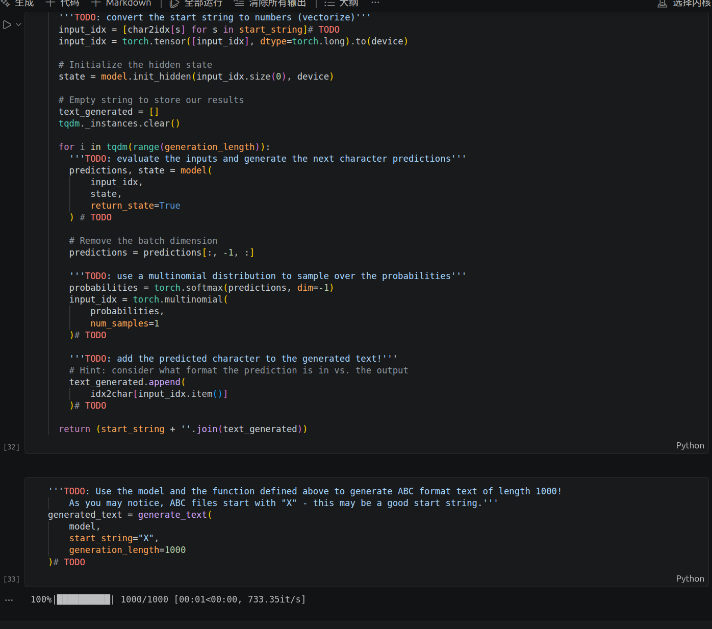
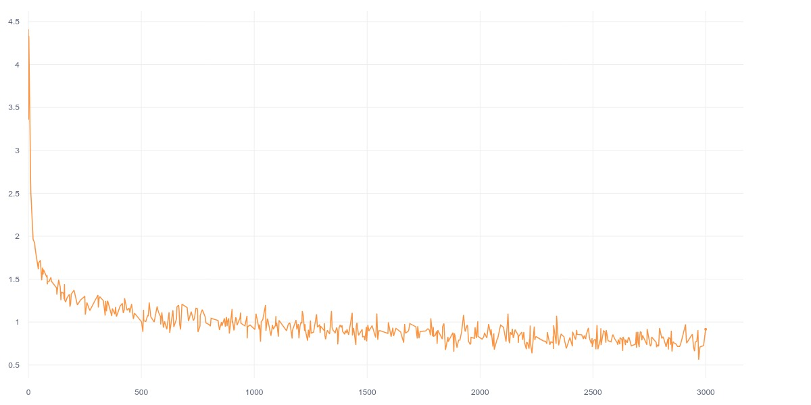

# Lab 1 实验报告：基于 PyTorch 的 LSTM 音乐生成

- GitHub Repository: [github](https://github.com/mwq21/introtodeeplearning)
- Comet Experiment: [Comet 实验记录](https://www.comet.com/mingwei-qiu/6s191-lab1-part2/view/new/panels)

## 项目目录结构

```text
lab1/
├── PT_Part1_Intro.ipynb
├── PT_Part2_Music_Generation.ipynb
├── results/
│   ├── training_loss.png
│   ├── generated_music.abc
│   └── screenshots/
└── REPORT.md
```

## 1. 实验内容

本实验包含两部分：

- Part 1：PyTorch 基础，包括 Tensor、`nn.Module`、`nn.Sequential`、Autograd 和梯度下降。
- Part 2：使用字符级 LSTM 对 ABC notation 音乐进行建模，并生成新的音乐序列。

整体流程：

```text
ABC 音乐文本
    ↓
字符编码
    ↓
构造训练序列
    ↓
Embedding
    ↓
LSTM
    ↓
Linear
    ↓
Cross Entropy Loss
    ↓
Adam 优化
    ↓
自回归生成 ABC 音乐
```

## 2. 关键代码理解

### 2.1 `nn.Module` 与自定义前向过程

PyTorch 中常用的模型定义方式是继承 `nn.Module`，在 `__init__()` 中定义网络层，在 `forward()` 中定义数据如何通过网络。

本实验中通过 `LinearButSometimesIdentity` 展示了 `forward()` 可以根据参数改变网络行为：

```python
def forward(self, inputs, isidentity=False):
    if isidentity:
        return inputs
    else:
        return self.linear(inputs)
```

这说明 `nn.Module` 不只是简单堆叠网络层，也可以实现条件分支等自定义计算逻辑。



### 2.2 Autograd 与梯度下降

PyTorch 使用 Autograd 自动记录计算图，并通过 `backward()` 计算梯度。

实验中最小化：

\[
L=(x-x_f)^2
\]

核心更新过程为：

```python
loss = (x - x_f) ** 2
loss.backward()
x = x.item() - learning_rate * x.grad
```

可以看到变量从随机初值逐渐收敛到目标值 `x_f=4`。



### 2.3 字符编码

音乐数据使用 ABC notation 表示，本质上是一段字符序列。模型不能直接处理字符，因此需要先建立 `char2idx` 映射，将字符转换为整数索引：

```python
def vectorize_string(string):
    vectorized_output = np.array(
        [char2idx[char] for char in string]
    )
    return vectorized_output
```

这样文本就可以作为神经网络输入。



### 2.4 LSTM 模型

模型由三部分组成：

```python
self.embedding = nn.Embedding(vocab_size, embedding_dim)
self.lstm = nn.LSTM(
    embedding_dim,
    hidden_size,
    batch_first=True
)
self.fc = nn.Linear(hidden_size, vocab_size)
```

数据形状变化为：

```text
[B, L]
  ↓ Embedding
[B, L, embedding_dim]
  ↓ LSTM
[B, L, hidden_size]
  ↓ Linear
[B, L, vocab_size]
```

Embedding 将字符索引转换为向量；LSTM 建模字符序列中的时序关系；Linear 将隐藏状态映射到字符词表大小，用于预测下一个字符。



### 2.5 Loss 计算

模型输出 `logits` 的形状为 `[B, L, V]`，标签形状为 `[B, L]`。为了使用交叉熵损失，需要将 batch 和 sequence 两个维度展开：

```python
batched_labels = labels.view(-1)
batched_logits = logits.view(-1, logits.size(-1))

loss = cross_entropy(
    batched_logits,
    batched_labels
)
```

展开后，每个时间位置都可以看作一个独立的字符分类任务。



### 2.6 自回归生成

训练完成后，模型根据当前输入预测下一个字符，再将采样得到的字符作为下一步输入：

```python
predictions, state = model(
    input_idx,
    state,
    return_state=True
)

predictions = predictions[:, -1, :]
probabilities = torch.softmax(predictions, dim=-1)

input_idx = torch.multinomial(
    probabilities,
    num_samples=1
)

text_generated.append(
    idx2char[input_idx.item()]
)
```

该过程循环执行，最终生成新的 ABC 音乐文本。



## 3. 复现过程与结果

### 3.1 模型训练

模型使用 Adam 优化器和 Cross Entropy Loss 训练 3000 iterations，并通过 Comet 记录训练过程。

训练 Loss 曲线：



Loss 从训练初期的较高值快速下降，随后逐步稳定收敛，说明模型能够学习 ABC 音乐中的字符序列规律。

### 3.2 音乐生成

训练完成后，模型生成新的 ABC 格式音乐序列。

生成文件：

[generated_music.abc](results/generated_music.abc)

## 4. 最终 Demo

生成音乐的结果。

## 5. 总结

本实验完成了从 PyTorch 基础、自动求导，到字符编码、LSTM 建模、交叉熵损失、反向传播和自回归生成的完整流程。Part 1 用简单例子理解了 PyTorch 的模型与梯度机制，Part 2 将这些内容应用到字符级音乐生成任务中。
